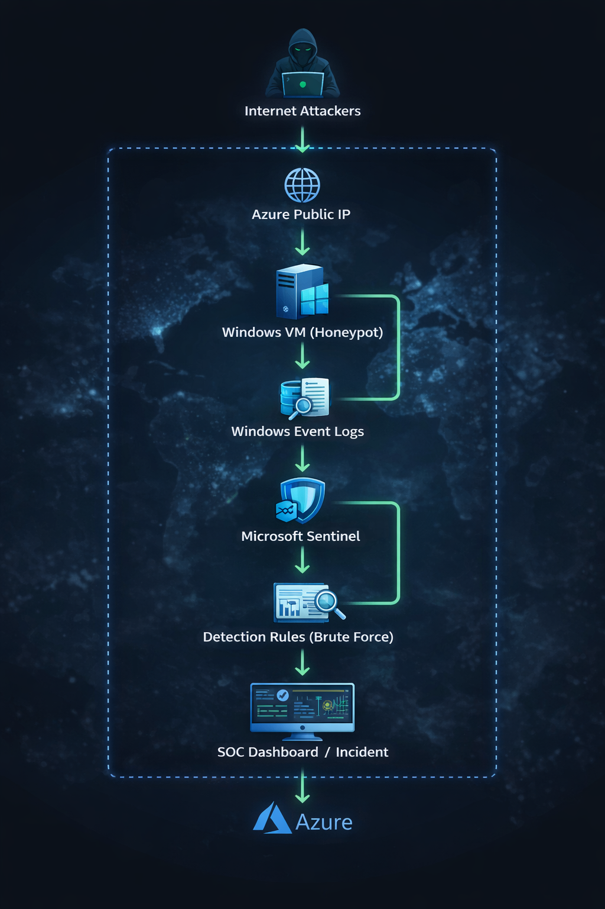
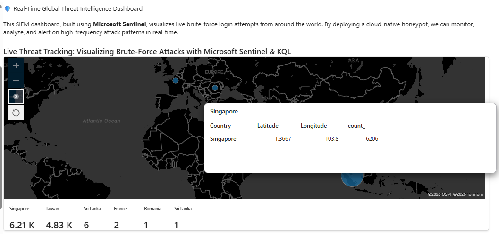
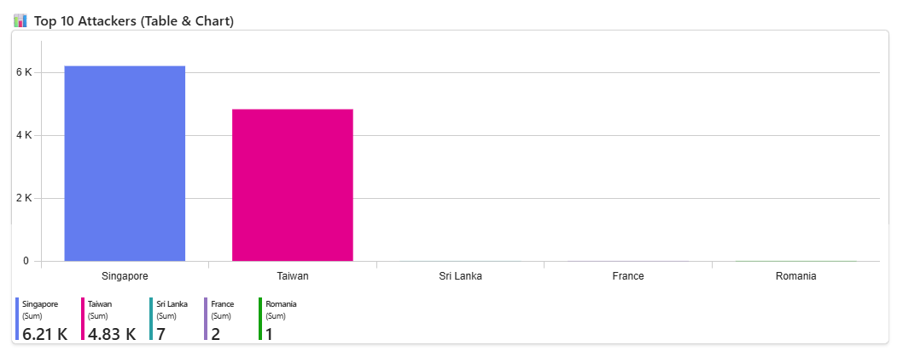
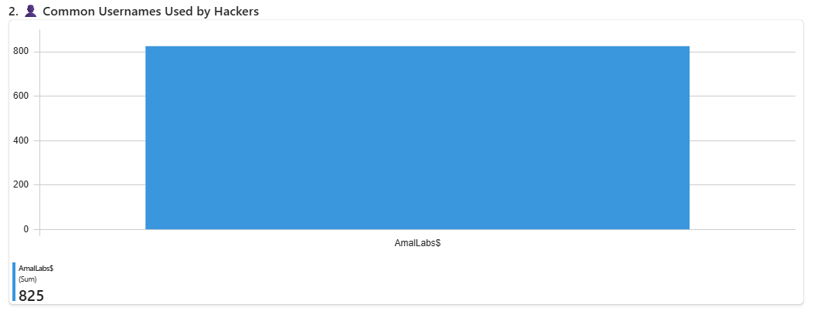
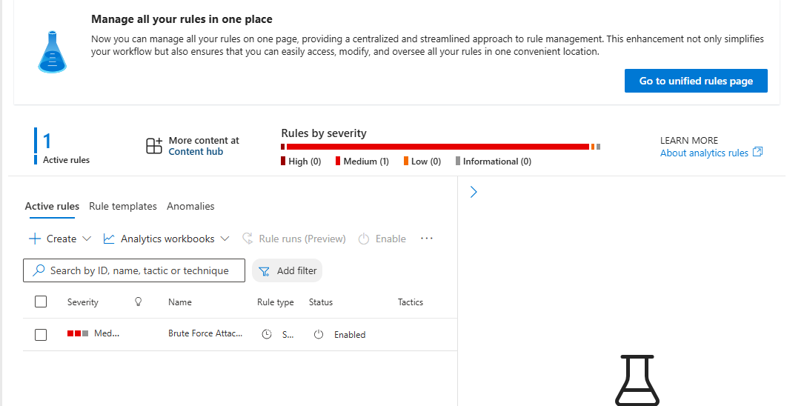

# 🛡️ Azure Honeypot Lab – Real-Time Global Threat Map using Microsoft Sentinel

## 📝 Project Overview

This project demonstrates how a **cloud-based honeypot environment** can be deployed in Microsoft Azure to detect and analyze real-world cyber attacks.

A vulnerable Windows virtual machine was intentionally exposed to the internet to attract **RDP brute-force attacks**. Security logs generated from these attempts were collected and sent to a Log Analytics Workspace where they were analyzed using Microsoft Sentinel.

Using **Kusto Query Language (KQL)**, the raw authentication logs were transformed into meaningful security insights and visualized on an interactive dashboard that highlights the global origin of attack attempts.

This lab simulates a **real Security Operations Center (SOC) workflow**, including threat detection, log analysis, and incident generation.

---

## 🏗 Architecture

The following architecture shows how attack telemetry flows through the system.

Attackers attempt to brute-force login credentials through Remote Desktop Protocol (RDP) on a publicly exposed Windows virtual machine. These failed authentication attempts are captured in Windows Event Logs and forwarded to Azure Log Analytics. Microsoft Sentinel analyzes the logs, detects suspicious activity patterns, and generates security incidents while visualizing global attack activity.

---

## 🛠️ Key Technologies & Skills

### Cloud Platform
- Microsoft Azure

### SIEM Platform
- Microsoft Sentinel

### Log Management
- Azure Log Analytics Workspace

### Threat Detection & Querying
- Kusto Query Language (KQL)

### Automation
- PowerShell scripting for IP geolocation enrichment

### Network Security
- Azure Network Security Groups (NSG)
- Windows Firewall configuration

---

## 📊 Results & Threat Intelligence Insights

During the monitoring period, the honeypot environment captured **over 11,000 failed RDP login attempts within a few hours**.

### Key Observations

- **Singapore:** ~6.21K attack attempts  
- **Taiwan:** ~4.83K attack attempts  
- Attackers frequently targeted **common administrative usernames**
- Several automated bots attempted repeated password brute-force attacks
- Real-time analytics rules successfully generated **security incidents in Microsoft Sentinel**

These insights demonstrate how SIEM systems transform raw log data into actionable threat intelligence.

---

## 📸 Project Screenshots

### 1. Global Attack Map – Visualizing Brute-Force Attempts

This dashboard visualizes the geographic origin of attack attempts targeting the honeypot VM.

---

### 2. Top Attacking Countries

This visualization highlights the countries generating the highest volume of brute-force login attempts.

---

### 3. Common Usernames Targeted by Attackers

Attackers often target predictable administrative usernames when performing automated brute-force attacks.

---

### 4. Real-Time Brute-Force Detection Rule

A Microsoft Sentinel analytics rule was configured to automatically detect suspicious login patterns and generate security incidents.

---

## 🧠 Security Skills Demonstrated

This project demonstrates hands-on experience with several cybersecurity and cloud security concepts:

- SIEM deployment and configuration
- Threat hunting using KQL queries
- Cloud security monitoring in Azure
- Log ingestion and analysis
- Brute-force attack detection engineering
- Security incident generation and investigation
- Honeypot deployment for attack telemetry collection

---

## 🚀 Future Enhancements

Planned improvements for the project include:

- Integrating additional threat intelligence feeds
- Automating response actions for detected threats
- Expanding the honeypot environment to include web services and SSH
- Creating automated incident response playbooks

---

## 👨‍💻 Author

**Amal Udayanga Basnayake**

This project was developed as part of ongoing hands-on practice in:

- Cybersecurity
- Cloud Security
- SIEM Operations
- Threat Detection Engineering

Feel free to explore the repository, provide feedback, or connect for collaboration.
